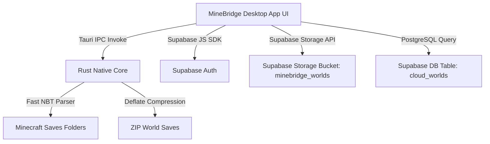

# 🌉 MineBridge — Cloud Save Manager for Minecraft

<p align="center">
  
</p>

<p align="center">
  <b>A plug-and-play, cross-platform cloud save manager for Minecraft (Java & Bedrock Edition).</b><br>
  Built with <b>Tauri v2 + Rust + React 19 + TypeScript + Supabase Storage & PostgreSQL</b>.
</p>

<p align="center">
  
  
  
  
  
  
</p>

---

## ✨ Features

- 💎 **Minecraft Native Aesthetic**: Sleek glassmorphic UI with enchanted particle background effects, custom Titlebar, and status indicators.
- 🔍 **Native Rust World Scanner**: Automatically detects world directories for:
  - Official Minecraft Java Edition (`.minecraft/saves`)
  - Official Minecraft Bedrock Edition (Windows UWP & GDK)
  - Prism Launcher instances (Native & Flatpak)
- 🚀 **Cloud Backup & Restore**: One-click upload and download of `.zip` world saves directly to Supabase Storage.
- 🛡️ **Atomic Safety Backups**: Automatic backup zip created in `%APPDATA%\MineBridge\backups\` before overwriting any local world folder during restoration.
- ⚡ **Conflict Resolution**: Smart SHA-256 hash comparison and timestamp tracking to resolve local vs. cloud version conflicts.
- 🌐 **Real-time i18n**: Instant language switching between **Portuguese (pt-BR)** and **English (en)**.
- 🔑 **Flexible Authentication**: Supabase Auth with Email, OAuth (Discord/Google/Microsoft), and offline Guest Demo Mode.
- 🐧 **Linux & Windows Native**: Cross-platform support for `.msi` (Windows) and `.AppImage` / `.deb` (Linux).

---

## 🛠️ Architecture



---

## 📦 Installation & Setup

### Prerequisites
- [Node.js v20+](https://nodejs.org/)
- [Rust Toolchain](https://www.rust-lang.org/tools/install)

### Development Setup

1. **Clone the repository**:
   ```bash
   git clone https://github.com/your-username/MineBridge.git
   cd MineBridge
   ```

2. **Install frontend dependencies**:
   ```bash
   npm install
   ```

3. **Configure Environment Variables**:
   Create `.env` in project root:
   ```env
   VITE_SUPABASE_URL=https://your-project.supabase.co
   VITE_SUPABASE_ANON_KEY=your-anon-key
   ```

4. **Initialize Supabase Database & Storage**:
   Copy the contents of [`supabase_schema.sql`](./supabase_schema.sql) and execute it in your **Supabase Dashboard -> SQL Editor**.

5. **Run the Development Server**:
   ```bash
   npm run tauri dev
   ```

---

## 🚀 Building for Production

### Build Executables

- **Windows (.msi)**:
  ```bash
  npm run tauri build
  ```
  *Output: `src-tauri/target/release/bundle/msi/MineBridge_0.1.0_x64_en-US.msi`*

- **Linux (.AppImage / .deb)**:
  Run `npm run tauri build` on Linux or let GitHub Actions build binaries automatically on push.

---

## 🛡️ License

Distributed under the MIT License. See `LICENSE` for details.
